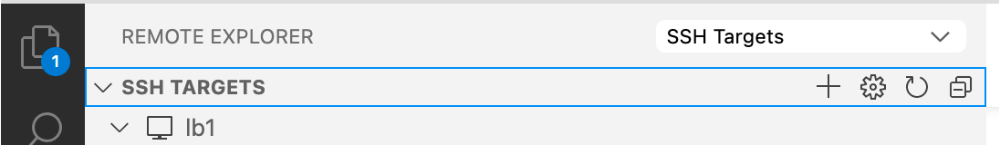

IIp - Parallel Programming course
*********************************

User guide for a development environment for the course *2000WETPPR - Parallel Programming*.

Setting up your environment
===========================

We will develop our Parallel Programming projects on the VSC Cluster *Leibniz*, which is hosted by UAntwerpen.
To access *Leibniz* you need either

* a VSC account, or a
* guest account.

To view and edit your project directories and files, or execute the scripts and programs you write,
we use Visual Studio Code (VSCode), which is a graphical IDE (integrated developmnent environment).
This allows for a smoother experience than the standard terminal based access on the cluster.

Setting up your local environment
---------------------------------

Install a SSH client
^^^^^^^^^^^^^^^^^^^^

To make a connection with a remote machine (c.q. *Leibniz*), you need a supported SSH client.
This comes pre-installed on macOS, for Windows and Linux, check `here <https://code.visualstudio.com/docs/remote/troubleshooting#_installing-a-supported-ssh-client>`_.

Install and setup Visual Studio Code for remote development with Python, C++ and Fortran
^^^^^^^^^^^^^^^^^^^^^^^^^^^^^^^^^^^^^^^^^^^^^^^^^^^^^^^^^^^^^^^^^^^^^^^^^^^^^^^^^^^^^^^^

Install VSCode (Visual Studio Code) from https://code.visualstudio.com/download for your operating system.
Open VSCode, press the ``Extensions`` button

in the toolbar on the left, search for the items below, and install them.

In the figure below we searched for all extensions with a name containing 'Remote'.

.. image:: pictures/Extensions_Marketplace.png

We need these VSCode extensions (plugins):

* Remote - SSH
* Remote Development
* Preview
* Python
* MagicPython
* Python for VSCode
* Pylance
* CMake
* CMake Tools
* C/C++
* C/C++ Extension Pack
* C/C++ Themes
* Better C++ Syntax
* Modern Fortran

Next we must create an `SSH Target` to establish a connection to *Leibniz*. In the vertical toolbar on the left,
press the ``Remote Explorer`` button,

and make sure the dropdown menu next toe `Remote Explorer` shows `SSH Targets:

Press the `+` to create a new SSH Target. You will be prompted to fill in

1. The ssh command to connect with::

    > ssh <userid>@login1-leibniz.hpc.uantwerpen.be -i </path/to/your/private-key>

   Where ``<userid>`` is the userid of your VSC account, or guest account, ``login1-leibniz.hpc.uantwerpen.be``
   is the name of login-node 1 on *Leibniz* and ``</path/to/your/private-key>`` is the full path to the **private**
   key that you created for your account. (Note that on windows you must use backslashes as the path separator).

3. Next, it with will prompt you for the location of the ssh config file. The default location is generally ok.
   A new entry with the name `login1-leibniz.hpc.uantwerpen.be` will appear in the `SSH Targets` list.

   .. image:: pictures/SSH_Targets_2.png

4. To establish a connection you right-click on the new entry, choose ``Connect to host in current window``
   or ``Connect to host in new window`` and enter a remote location (directory) where you want to start to
   work. A good place is ``/scratch/antwerpen/???/<userid>``. If you now press the ``Explorer`` button in the
   toolbar on the left

   .. image:: pictures/Explorer_icon.png

   the tree view of the remote location you entered is shown.

Setting up your remote environment
----------------------------------

Open VSCode, and select `View/Terminal` from the menu bar. A window pane with a terminal will open, with
the chosen location as the current working directory. It is a Linux terminal, because the login-nodes
of all VSC clusters run Linux as operation system. If you are not familiar with Linux, check out
[Basic Linux usage](https://docs.vscentrum.be/en/latest/jobs/basic_linux_usage.html?highlight=linux).

In the terminal enter the following commands::

    > $ module load git

This command makes the `git` command available. Contrary to PCs, HPC systems do not make all installed
software directly available. The user must specify which software packages he wants to use by loading
modules. The command::

    > $ module list

    Currently Loaded Modules:
      1) leibniz/supported   2) git/2.35.1

lists all loaded modules. Usually the listed entries offer information on the version of the package.
Next, we use git to download a git repository that was prepared for this course::

    > git clone https://github.com/etijskens/iip
    ...

and ``dd`` into the ``IIp`` directory::

    > cd IIp

Documentation: https://iip.readthedocs.io
