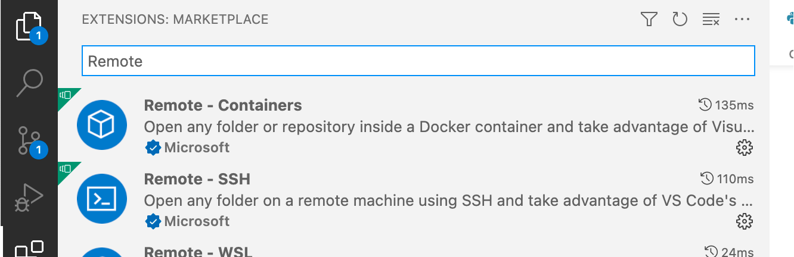
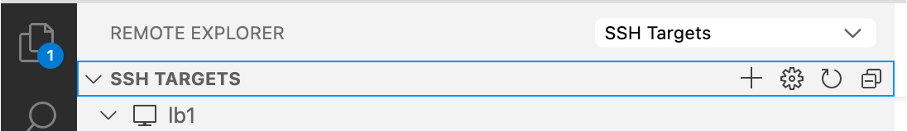
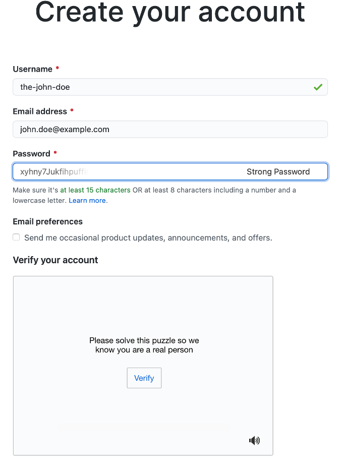

.. include:: hyperlinks.rst

.. _setupDevEnv:

***************************************
Setting up your development environment
***************************************

We will develop our Parallel Programming projects on the VSC Cluster *Leibniz*, which is hosted by UAntwerpen.
To access *Leibniz* you need either

* a VSC account, or a
* guest account.

To view and edit your project directories and files, or execute the scripts and programs you write,
we use Visual Studio Code (VSCode), which is a graphical IDE (integrated developmnent environment).
This allows for a smoother experience than the standard terminal based access on the cluster.

Setting up your local environment
---------------------------------

Install a SSH client
^^^^^^^^^^^^^^^^^^^^

To make a connection with a remote machine (c.q. *Leibniz*), you need a supported SSH client.
This comes pre-installed on macOS, for Windows and Linux, check `here <https://code.visualstudio.com/docs/remote/troubleshooting#_installing-a-supported-ssh-client>`_.

Install and setup Visual Studio Code for remote development with Python, C++ and Fortran
^^^^^^^^^^^^^^^^^^^^^^^^^^^^^^^^^^^^^^^^^^^^^^^^^^^^^^^^^^^^^^^^^^^^^^^^^^^^^^^^^^^^^^^^

Install VSCode (Visual Studio Code) from https://code.visualstudio.com/download for your operating system.
Open VSCode, press the ``Extensions`` button

in the toolbar on the left, search for the items below, and install them.

In the figure below we searched for all extensions with a name containing 'Remote'.

We need these VSCode extensions (plugins):

* Remote - SSH
* Remote Development
* Preview
* Python
* MagicPython
* Python for VSCode
* Pylance
* CMake
* CMake Tools
* C/C++
* C/C++ Extension Pack
* C/C++ Themes
* Better C++ Syntax
* Modern Fortran

Connecting to *Leibniz* in VSCode
^^^^^^^^^^^^^^^^^^^^^^^^^^^^^^^^^

Next, we must create an `SSH Target` to establish a connection to *Leibniz*. In the vertical toolbar on the left,
press the ``Remote Explorer`` button,

and make sure the dropdown menu next toe ``Remote Explorer`` shows ``ß``:

Press the `+` to create a new SSH Target. You will be prompted to fill in

1. The ssh command to connect with::

    > ssh <userid>@login1-leibniz.hpc.uantwerpen.be -i </path/to/your/private-key>

   Where ``<userid>`` is the userid of your VSC account, or guest account, ``login1-leibniz.hpc.uantwerpen.be``
   is the name of login-node 1 on *Leibniz* and ``</path/to/your/private-key>`` is the full path to the **private**
   key that you created for your account. (Note that on windows you must use backslashes as the path separator).

3. Next, it with will prompt you for the location of the ssh config file. The default location is generally ok.
   A new entry with the name `login1-leibniz.hpc.uantwerpen.be` will appear in the `SSH Targets` list.

   .. image:: pictures/SSH_Targets_2.png

4. To establish a connection you right-click on the new entry, choose ``Connect to host in current window``
   or ``Connect to host in new window`` and enter a remote location (directory) where you want to start to
   work. A good place is::

        /scratch/antwerpen/<xyz>/<userid>

   (<xyz> are the first three digits of your userid, e.g. ``123`` If your userid were ``vsc12345``).
   For a guest account this would be::

       /scratch/antwerpen/gst/<guestid>

   After Pressing ``Open`` you may select a subdirectory to start working in.
   If you now press the ``Explorer`` button in the toolbar on the left

   .. image:: pictures/Explorer_icon.png

   the tree view of the remote location you entered is shown.

Setting up your remote environment
----------------------------------

Open VSCode, and select `View/Terminal` from the menu bar. A window pane with a terminal will open, with
the chosen location as the current working directory. It is a Linux terminal, because the login-nodes
of all VSC clusters run Linux as operation system. If you are not familiar with Linux, check out
`Basic Linux usage <https://docs.vscentrum.be/en/latest/jobs/basic_linux_usage.html?highlight=linux>`_.

In the terminal enter the following commands::

    > module load git

This command makes the `git` command available. Contrary to PCs, HPC systems do not make all installed
software directly available. The user must specify which software packages he wants to use by loading
modules. The command::

    >  module list

    Currently Loaded Modules:
      1) leibniz/supported   2) git/2.35.1

lists all loaded modules. Usually the listed entries offer information on the version of the package.
Next, we use git to download a git repository that was prepared for this course::

    > git clone https://github.com/etijskens/IIp
    Cloning into 'IIp'...
    remote: Enumerating objects: 67, done.
    remote: Counting objects: 100% (67/67), done.
    remote: Compressing objects: 100% (48/48), done.
    remote: Total 67 (delta 10), reused 65 (delta 8), pack-reused 0
    Unpacking objects: 100% (67/67), done.

(The output may vary as the IIp project is still evolving)
Then, ``cd`` into the ``IIp`` directory and source the ``iip-installs.sh`` script to install some Python
packages that we will need for our work and which are not pre-installed on the cluster::

    > cd IIp
    > source ./bin/iip-installs.sh
    ...

The following Python packages are installed:

* micc2_: a package to manage our project. Setup of a versatile project structure, with hooks
  for documentation and testing, version management, setup of local and remote git repos, building
  Python modules from C++ or Fortran code.
* numba_: accelerating Python functions.

The install location for Python packages is set to ``$VSC_SCRATCH/.local``, instead of the default
``$VSC_HOME/.local`` to avoid that the disk quota of ``$VSC_HOME`` are exceeded.

Preparing for Version Control
-----------------------------

A Version Control System (VCS) is extremely useful for software development. Among others, it
provides you with a backup of every commited version of your work. This backup can be both local
and remote. So, even if you loose your machine, you wont loose your work. At any time,
you may switch back to earlier versions and continue from there.

We will use git_ for version control, and put our remote repositories on GitHub_. That is all free,
but you need to acquire a GitHub_ account.

Creating a GitHub_ account
^^^^^^^^^^^^^^^^^^^^^^^^^^

Go to GitHub_, enter your e-mail address and click “Sign up for GitHub”:

You will then be prompted to choose your username and a password. Then, click ''Verify” and solve
the puzzle. A button “Create account” will appear, press it. You will receive an e-mail at the e-mail
address you provided with instructions to activate your account. Here's a screenshot:

You also need a "github personal access token" for micc2_ to be able to automatically create remote
repositories for new projects. Follow
`this guide <https://docs.github.com/en/github/authenticating-to-github/creating-a-personal-access-token>`_:

* At point 7 check at least the boxes

  * ``repo``, and
  * ``read:org``.

* After point 9 (copying the token), go to the VSCode terminal you opened before, and execute the
  following command::

    > echo <paste> > ~/<your-github-username>.txt

  where ``<paste>`` is the keyboard shortcut for pasting on your operating system. (On Windows this is
  ``ctrl+v``, on Linux ``shift+ctrl+v``, and on macOS ``cmd+v``). ``<your-github-username>`` is the
  username that you chose above when creating your GitHub_ account.

* Skip point 10.

Setting up micc2_
^^^^^^^^^^^^^^^^^

Now that you have a GitHub_ account and a personal acces token, we are ready to set up micc2_,
to provide it with the necessary information to access your GitHub_ account, and create remote
repositories automatically, when you start a new project with micc2_.

Run the following commands in the VSCode terminal::

    > source $VSC_SCRATCH/iip/bin/iip-env.sh

This command is only needed if you just started a new terminal and the environment was not yet
prepared. Next, run ``micc2 setup``, supplying the data asked for after the ``:>`` prompt. You
can use ``^^`` to abort the setup .

.. code-block::

    > micc2 setup

    Enter your full name
    Enter `^^` to exit.
    >: John Doe

    Enter your e-mail address
    Enter `^^` to exit.
    >: john.doe@example.com

    Enter your github username (leave empty if you do not have one,
      or create one first at https://github.com/join). Default = []
    Enter `^^` to exit.
    >: the-john-doe

    Enter Html theme for sphinx documentation. Default = [sphinx_rtd_theme]
    Enter `^^` to exit.
    >:
    These preferences are saved to /user/antwerpen/201/vsc20170/.micc2/micc3.cfg:
    {
      "full_name": "John Doe",
      "email": "john.doe@example.com",
      "github_username": "the-john-doe",
      "sphinx_html_theme": "sphinx_rtd_theme",
      "version": "0.0.0",
      "github_repo": "{{cookiecutter.project_name}}",
      "git_default_branch": "master",
      "minimal_python_version": "3.7",
      "py": "py"
    }
    Continue? yes/no >:
    Preferences saved to /user/antwerpen/<XYZ>/<vsc-userid>/.micc2/micc3.cfg.
    Configuring git:
      git config --global user.name the-john-doe
      git config --global user.email john.doe@example.com
    Paste your GitHub personal access token, or the file location containing it:
    :> ~/the-john-doe.pat

Congratulations, you have completed the setup! A good next step is to checkout the micc2_
documentation.
