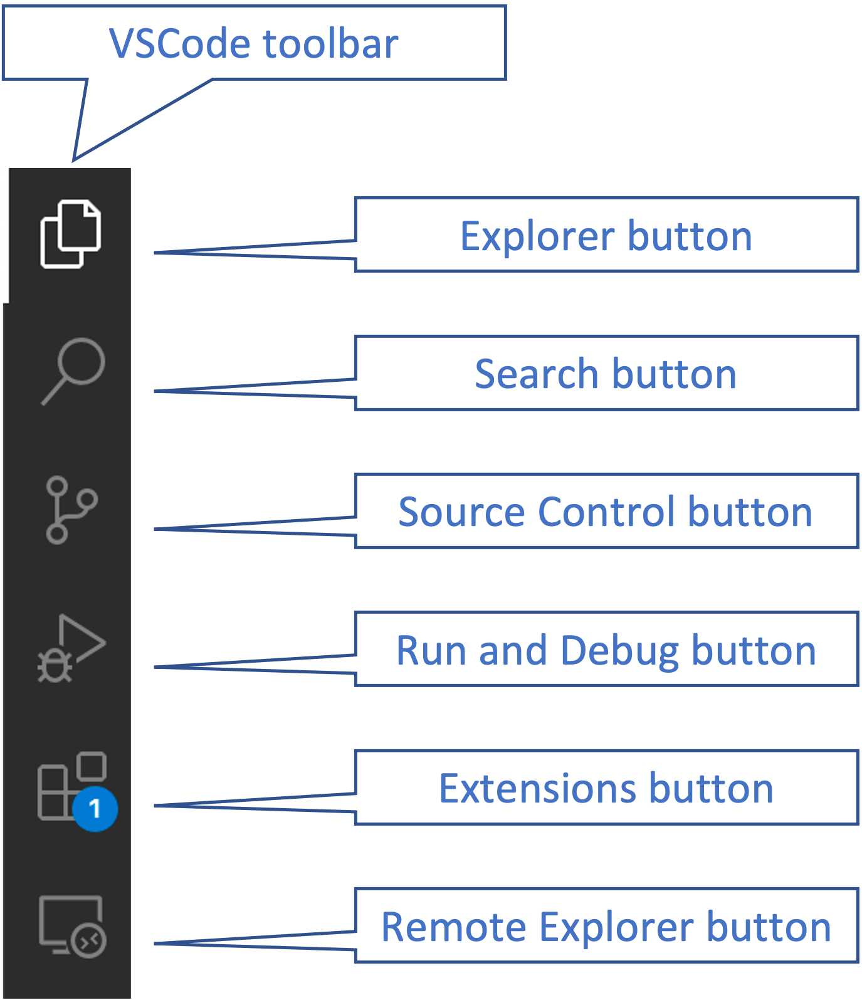
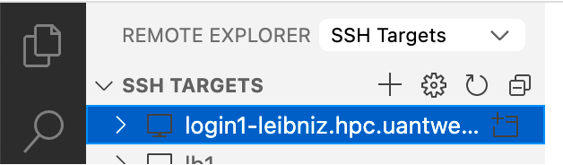
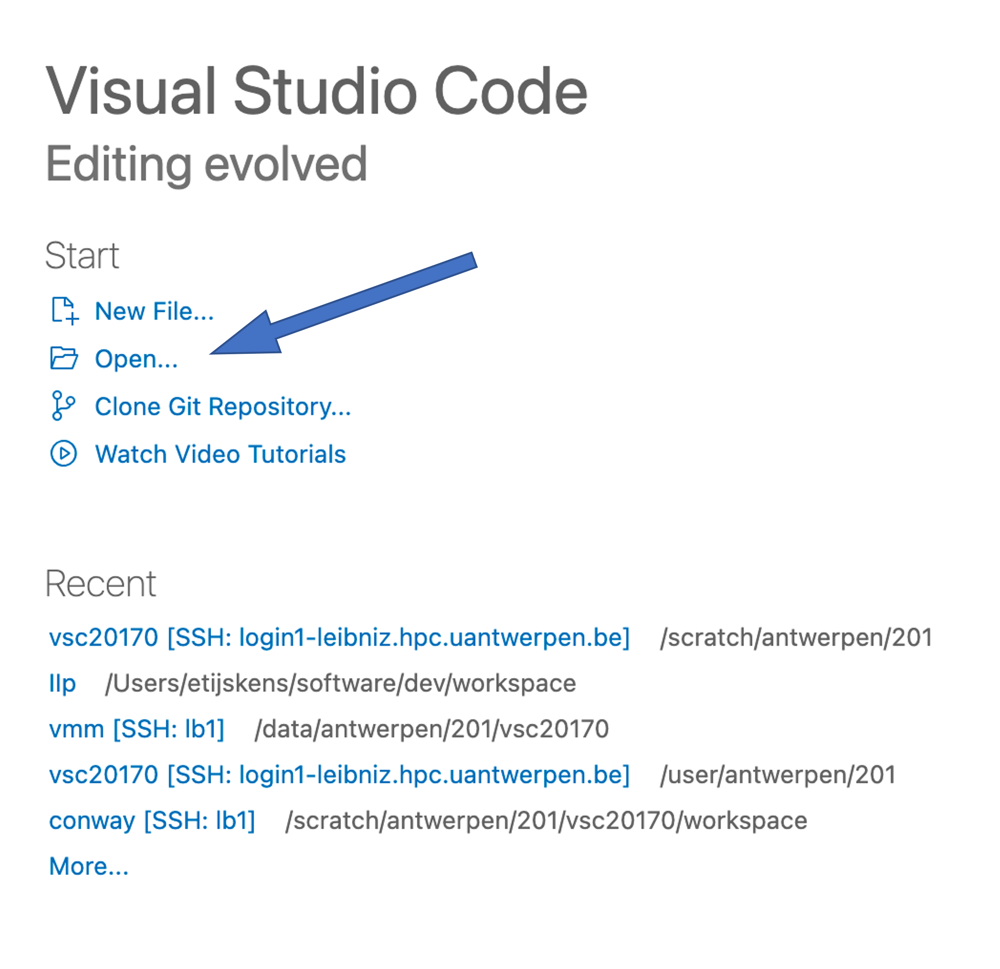

.. include:: hyperlinks.rst

.. _setupDevEnv:

***************************************
Setting up your development environment
***************************************

We will develop our Parallel Programming projects on the VSC Cluster *Leibniz*, which is hosted by UAntwerpen.
To access *Leibniz* you need either

* a VSC account (``vscXXYYY``) , or
* a guest account (``guestYYY``).

To view and edit your project directories and files, or execute the scripts and programs you write,
we use Visual Studio Code (VSCode), which is a graphical IDE (integrated developmnent environment).
This allows for a smoother experience than the standard terminal based access on the cluster.

You might find the `documentation for using the VSC clusters <https://docs.vscentrum.be/en/latest/>`_
useful.

.. _setup-local:

Setting up your local environment
---------------------------------

Install a SSH client
^^^^^^^^^^^^^^^^^^^^

To make a connection with a remote machine (c.q. *Leibniz*), you need a supported SSH client.
This comes pre-installed on macOS. For Windows and Linux, check
`this <https://code.visualstudio.com/docs/remote/troubleshooting#_installing-a-supported-ssh-client>`_.

Install and setup Visual Studio Code for remote development with Python, C++ and Fortran
^^^^^^^^^^^^^^^^^^^^^^^^^^^^^^^^^^^^^^^^^^^^^^^^^^^^^^^^^^^^^^^^^^^^^^^^^^^^^^^^^^^^^^^^

Install VSCode (Visual Studio Code) from https://code.visualstudio.com/download for your operating
system. Then, open VSCode. On the left you see a vertical toolbar with some buttons:

.. _vscode-toolbar:

   The VSCode_ toolbar

Each of the buttons opens a correspondig window pane for a specific task.

* The ``Explorer`` pane provides a directory view of the current workspace, which may be local
  or remote (we will only work with remote workspaces on *Leibniz*).
* The ``Search`` pane is for searching in that workspace.
* The ``Source Control`` pane lets you manipulate the git_ repository in your project.
* The ``Run and Debug`` pane is for running and debugging programs and scripts. (This we will not
  use because its functionally for working remotely is a bit limited and we will need to work
  around that).
* The ``Extension`` lets you install and manage VSCode_ extensions.
* Finally, the ``Remote Explorer`` button is at this point usually not available yet, as that
  VSCode_ comes with the ``Remote-SSH`` extension, which we still have to install. The
  corresponding pane manages all the different remote workspaces on the remote locations you
  have been working on. Here, you select the remote workspace, and in the ``Explorer`` pane
  you view and manipulate its directory tree.

Press the ``Extensions`` button to access the Extensions pane, search for the items below,
and install them. In the figure below we searched for all extensions with a name containing
s'Remote'.

.. _Extensions-pane:

.. figure:: pictures/Extensions_Marketplace.png
   :scale: 45%

   The *Extensions* pane.

We need these VSCode extensions (plugins):

* Remote - SSH
* Remote Development
* Preview
* Python
* MagicPython
* Python for VSCode
* Pylance
* CMake
* CMake Tools
* C/C++
* C/C++ Extension Pack
* C/C++ Themes
* Better C++ Syntax
* Modern Fortran

Obviously, you are free to explore other VSCode_ extensions - that's what learning is about!

Connecting to *Leibniz* in VSCode
^^^^^^^^^^^^^^^^^^^^^^^^^^^^^^^^^

Next, we must create an ``SSH Target`` to establish a connection to *Leibniz*. In the toolbar on the left,
press the ``Remote Explorer`` button (see :ref:`vscode-toolbar`),
and make sure the dropdown menu next to ``Remote Explorer`` shows ``SSH Targets``:

.. _Remote-Explorer-pane:

.. figure:: pictures/SSH_Targets.png
   :scale: 45%

   The *Remote Explorer* pane.

Press the `+` to create a new SSH Target. You will be prompted to fill in

Setting up an *SSH Target*
""""""""""""""""""""""""""

The ssh command to connect with::

    > ssh <userid>@login1-leibniz.hpc.uantwerpen.be -i </path/to/your/private-key>

Where ``<userid>`` is the userid of your VSC account, or guest account, ``login1-leibniz.hpc.uantwerpen.be``
is the name of login-node 1 on *Leibniz* and ``</path/to/your/private-key>`` is the full path to the **private**
key that you created for your account. (Note that on windows you must use backslashes as the path separator).

Next, it with will prompt you for the location of the ssh config file. The default location is generally ok.
A new entry with the name `login1-leibniz.hpc.uantwerpen.be` will appear in the `SSH Targets` list.

.. _Connecting:

Connecting to an *SSH Target*
"""""""""""""""""""""""""""""

To establish a connection you right-click on the SSH Target in the *Remote Explorer* pane ane choose
``Connect to host in current window`` or ``Connect to host in new window`` and enter a remote location
(directory) where you want to work. A good place is your data or scratch file system::

    /data/antwerpen/<xyz>/<userid>
    /scratch/antwerpen/<xyz>/<userid>

(<xyz> are the first three digits of your userid, e.g. ``123`` if your userid were ``vsc12345``).
For a guest account this would be::

   /data/antwerpen/gst/<guestid>
   /scratch/antwerpen/gst/<guestid>

.. note::
    On all VSC clusters you have access to three file systems with different properties. You might
    want to check out the `data storage VSC documentation <https://docs.vscentrum.be/en/latest/access/access_and_data_transfer.html#data-storage>`_
    for details.

The central pane will then show you a 'Get started' window. Press the ``Open ...`` button and select the
directory where you would want to start your work. Typically, this would be a *workspace* directory where
a some of your projects live, or a project directory.

.. _get-started:

   The *Get started* window.

Finally, press the ``Explorer`` button in :ref:`vscode-toolbar` to see the tree view of the your
remote working directory. Here, you can add, delete, rename files, etc. If you double click on a
file, the file is opened in the editor pane. The VSCode_ editor is a modern graphical editor with
lots of practical features: it is aware of the language you are programming in (you probably need
to install some extension) and can do syntax coloring, automatic indentation, on the fly syntax
checking, code completion, and so on.

SSH Target Troubleshooting
^^^^^^^^^^^^^^^^^^^^^^^^^^

Ssh debugging
"""""""""""""
If you fail to connect to *Leibniz*, try to open a terminal (command prompt or powershell in Windows). Add the
``-v``, ``-vv``, or ``-vvv`` to the ``ssh`` command to debug the ssh connection::

    ssh -v[v[v]] <userid>@login1-leibniz.hpc.uantwerpen.be -i </path/to/your/private-key>

This produces a lot more output that may help you to pinpoint the origin of the failure. This certainly
helps when the problem is the location of keys or configuration files.

Unprotected private key file error
""""""""""""""""""""""""""""""""""
A typical problem under Windows is the ``UNPROTECTED PRIVATE KEY FILE!`` warning. To fix this, check out
`Windows SSH: Permissions for 'private-key' are too open <https://superuser.com/questions/1296024/windows-ssh-permissions-for-private-key-are-too-open>`_.

Invalid format error
""""""""""""""""""""
Another typical problem under Windows is the ``Invalid format`` error, which arises when
the user generated a SSH key pair using ``PuTTY``, and forgot to convert the key to OpenSSH format.
Check out `Converting PuTTY keys to OpenSSH format <https://vlaams-supercomputing-centrum-vscdocumentation.readthedocs-hosted.com/en/latest/access/generating_keys_with_putty.html?highlight=putty#converting-putty-keys-to-openssh-format>`_
to remedy this.

Solving *Disk quota exceeded* due to ``.vscode-server`` getting too big
"""""""""""""""""""""""""""""""""""""""""""""""""""""""""""""""""""""""
When you start working remotely, ``vscode`` creates a hidden directory ``.vscode-server`` in
your ``$VSC_HOME`` directory. This directory may sometimes grow large, which in due of the
limited disk quota on ``$VSC_HOME`` (3 GB) may cause trouble. When you connect to a login node
on one of the VSC clusters, you always get a welcome message and a summary of your disk usage.
If you get a ``!!! warning: quota exceeded`` message, check the size of the ``.vscode-server``
directory with this command::

    > du -sh ~/.vscode-server
    1.3G	/user/antwerpen/201/vsc20170/.vscode-server/

If the size is significant when compared to the size quota on ``$VSC_HOME``, which usually
amounts to 3 GB, you might want to move the ``.vscode-server`` to another file system, e.g.
``$VSC_DATA`` or ``$VSC_SCRATCH``, and create a symbolic link for it in your home directory::

    > mv ~/.vscode-server $VSC_DATA
    > ln -s $VSC_DATA/.vscode-server ~/.vscode-server

You can check whether this succeeded by running::

    > ls -al .vscode-server
    lrwxrwxrwx 1 vsc20170 vsc20170 44 Nov  9 16:26 .vscode-server -> /data/antwerpen/201/vsc20170/.vscode-server/

This shows the existence of a symbolic link file ``.vscode-server`` in your home directory,
whichs redirects, as indicated by the ``->`` arrow, to the actual file at
``/data/antwerpen/201/vsc20170/.vscode-server/``.

If, however the reported size is small relative to the quota for your ``$VSC_HOME`` (3 GB)
then some other directory/file is causing the issue. Note that ``$VSC_HOME`` is not meant to
store your workspaces, data, ... (see
`Where can I store what kind of data <https://vlaams-supercomputing-centrum-vscdocumentation.readthedocs-hosted.com/en/latest/access/where_can_i_store_what_kind_of_data.html>`_).

.. _setup-remote:

Setting up your remote environment
----------------------------------

Clone the ``IIp`` repository
^^^^^^^^^^^^^^^^^^^^^^^^^^^^

Once you are able to connect, you can setup your environment on *Leibniz*.

``IIp`` is a GitHub_ repository that contains the documentation you are reading
right now, as well as some useful bash scripts to help you to set up your environment
correctly and automate some tasks.

Open VSCode, and select `View/Terminal` from the menu bar. A window pane with a terminal will open, with
the chosen location as the current working directory. It is a Linux terminal, because the login-nodes
of all VSC clusters run the Linux operation system (CentOS). If you are not familiar with Linux, check out
the VSC documentation
`Basic Linux usage <https://docs.vscentrum.be/en/latest/jobs/basic_linux_usage.html?highlight=linux>`_.

In the terminal, enter the following command::

    > module load git

This command makes the git_ command available. Contrary to PCs, HPC systems do not make all installed
software directly available. There are too many packages, and different versions might have conflicting
requirements. The user must specify which software packages he wants to use by loading
modules. The command::

    >  module list

    Currently Loaded Modules:
      1) leibniz/supported   2) git/2.35.1

lists all loaded modules. Module ``1) leibniz/supported`` is a general module that enables access to all
modules installed for *Leibniz*. Module ``2) git/2.35.1`` is the ``git`` module we just loaded. Generally, the
default version of a module is the most recently installed one, which in this case happens to be 2.35.1::

    > git --version
    git version 2.35.1

Next, we ``cd``  into the scratch file system and use git_ to download (clone in git_ language) the
IIp_ GitHub_ repository that was prepared for this course::

    > cd $VSC_SCRATCH
    > git clone https://github.com/etijskens/IIp
    Cloning into 'IIp'...
    remote: Enumerating objects: 67, done.
    remote: Counting objects: 100% (67/67), done.
    remote: Compressing objects: 100% (48/48), done.
    remote: Total 67 (delta 10), reused 65 (delta 8), pack-reused 0
    Unpacking objects: 100% (67/67), done.

(The output may vary as the IIp project is still evolving). The ``IIp`` repository contains the documentation
you are reading here, as well as the some useful scripts to setup your environment.

Then, source its ``iip-installs.sh`` script to install some Python
packages that we will need for our work and which are not pre-installed on the cluster::

    > source ./IIp/bin/iip-installs.sh
    ...

The following Python packages are installed:

* Micc2_: a package to manage our project. Setup of a versatile project structure, with hooks
  for documentation and testing, version management, setup of local and remote git repos, building
  Python modules from C++ or Fortran code.
* Numba_: accelerating Python functions.

The install location for Python packages is set to ``$VSC_SCRATCH/.local``, instead of the default
``$VSC_HOME/.local`` to avoid that the disk quota of ``$VSC_HOME`` are exceeded.

.. note::

    This ``iip-install.sh`` script installs Micc2_ and Numba_ in the current Python environment **only**,
    which``iip-install.sh`` sets by sourcing the ``iip-env.sh`` script. Both scripts however accept an
    optional name of module with the Python distribution you wantm to work with::

        > source ./bin/iip-install.sh IntelPython3 # calls 'source ./bin/iip-install.sh IntelPython3`

As the IIp_ projects is still evolving, you might want to update it from time to time::

    > cd $VSC_SCRATCH/IIp
    > git pull
    remote: Enumerating objects: 49, done.
    remote: Counting objects: 100% (49/49), done.
    remote: Compressing objects: 100% (16/16), done.
    remote: Total 39 (delta 27), reused 32 (delta 20), pack-reused 0
    Unpacking objects: 100% (39/39), done.
    From https://github.com/etijskens/IIp
       b34e552..a5c19e3  main       -> origin/main
    Updating b34e552..a5c19e3
    Fast-forward
     SETUP.rst             |  0
     docs/authors.rst      |  2 +-
     docs/changelog.rst    |  5 -----
     docs/conf.py          | 24 ++++++++++++------------
     docs/index.rst        |  1 +
     docs/installation.rst |  9 ---------
     docs/setup.rst        | 96 +++++++++++++++++++++++++++++++++++++++++++++++++++++++++++++++++++++++++++++++++---------------
     docs/usage.rst        | 23 +++++++++++++++++------
     iip/__init__.py       |  2 +-
     pyproject.toml        |  2 +-
     10 files changed, 114 insertions(+), 50 deletions(-)
     delete mode 100644 SETUP.rst
     delete mode 100644 docs/changelog.rst
     delete mode 100644 docs/installation.rst

This pulls the latest changes in the remote GitHub_ IIp_ repository into the your ``IIp`` repository
on *Leibniz*. If you already have the latest version, ``git pull`` will tell you so::

    > git pull
    Already up-to-date.

Preparing for Version Control
^^^^^^^^^^^^^^^^^^^^^^^^^^^^^

A Version Control System (VCS) is extremely useful for software development. Among others, it
provides you with a backup of every commited version of your work. This backup can be both local
and remote. So, even if you loose your machine, you wont loose your work. At any time,
you may switch back to earlier versions and continue from there.

We will use git_ for version control, and put our remote repositories on GitHub_. That is all free,
but you need to create a GitHub_ account.

Creating a GitHub_ account
""""""""""""""""""""""""""

Go to GitHub_, enter your e-mail address and click “Sign up for GitHub”:

.. image:: pictures/github.png
   :scale: 20%

You will then be prompted to choose your username and a password. Then, click ''Verify” and solve
the puzzle. A button “Create account” will appear, press it. You will receive an e-mail at the e-mail
address you provided with instructions to activate your account. Here's a screenshot:

.. image:: pictures/createGitHubAccount.png
   :scale: 20%

You also need a "github personal access token" for micc2_ to be able to automatically create remote
repositories for new projects. Follow
`this guide <https://docs.github.com/en/github/authenticating-to-github/creating-a-personal-access-token>`_:

* At point 7 check at least the boxes

  * ``repo``, and
  * ``read:org``.

* After point 9 (copying the token), go to the VSCode terminal you opened before, and execute the
  following command::

    > echo <paste> > ~/<your-github-username>.txt

  where ``<paste>`` is the keyboard shortcut for pasting on your operating system. (On Windows this is
  ``ctrl+v``, on Linux ``shift+ctrl+v``, and on macOS ``cmd+v``). ``<your-github-username>`` is the
  username that you chose above when creating your GitHub_ account.

* Skip point 10.

Setting up micc2_
"""""""""""""""""

Now that you have a GitHub_ account and a personal access token, we are ready to set up micc2_,
to provide it with the necessary information to access your GitHub_ account, and create remote
repositories automatically, when you start a new project with micc2_.

Run the following command in the VSCode terminal and provide the information asked for. You may
abort the procedure by entering ``^^``::

    > micc2 setup

    Enter your full name
    Enter `^^` to exit.
    >: John Doe

    Enter your e-mail address
    Enter `^^` to exit.
    >: john.doe@example.com

    Enter your github username (leave empty if you do not have one,
      or create one first at https://github.com/join). Default = []
    Enter `^^` to exit.
    >: the-john-doe

    Enter Html theme for sphinx documentation. Default = [sphinx_rtd_theme]
    Enter `^^` to exit.
    >:
    These preferences are saved to /user/antwerpen/201/vsc20170/.micc2/micc3.cfg:
    {
      "full_name": "John Doe",
      "email": "john.doe@example.com",
      "github_username": "the-john-doe",
      "sphinx_html_theme": "sphinx_rtd_theme",
      "version": "0.0.0",
      "github_repo": "{{cookiecutter.project_name}}",
      "git_default_branch": "master",
      "minimal_python_version": "3.7",
      "py": "py"
    }
    Continue? yes/no >:
    Preferences saved to /user/antwerpen/<XYZ>/<vsc-userid>/.micc2/micc3.cfg.
    Configuring git:
      git config --global user.name the-john-doe
      git config --global user.email john.doe@example.com
    Paste your GitHub personal access token, or the file location containing it:
    :> ~/the-john-doe.pat

If you get an error ``bash: micc2: command not found``, you probably forgot to::

    > source $VSC_SCRATCH/iip/bin/iip-env.sh

