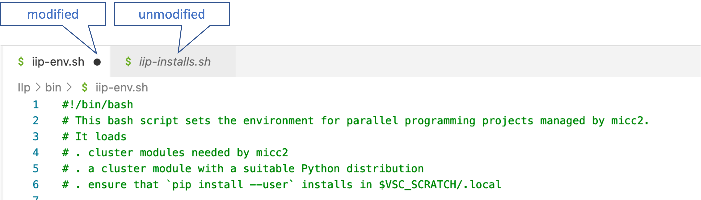

.. include:: hyperlinks.rst

******************************************************
Getting started with remote developement using VSCode_
******************************************************

After connecting to *Leibniz*, as described in :ref:`Connecting`, open the *Explorer* pane to
view the tree of your current working directory. Before starting any real work, it is good
practice to open a terminal first.

Opening a (VSCode) terminal
---------------------------

The terminal is typically used for:

* Version control with git. (Though you might want to try out the *Source Control* pane of VSCode_).
* Issuing Micc2_ commands, such as
    * for adding components as Python submodules, binary extension modules, command line interfaces,
    * for building binary extension modules
    * bumping the version of the project
* test runs
* debugging
* production runs

You can open a VSCode_ terminal from the menu bar ``View/Terminal``.
Every time you open a new terminal, you should ``source`` the ``IIp/bin/iip-env.sh`` script to
prepare your terminal environment for developing Python projects with Micc2_::

    > source $VSC_SCRATCH/IIp/bin/iip-env.sh

    Currently Loaded Modules:
      1) leibniz/supported   5) GCCcore/9.3.0                  9) Tcl/8.6.10-intel-2020a     13) HDF5/1.10.6-intel-2020a-MPI
      2) git/2.35.1          6) binutils/2.34-GCCcore-9.3.0   10) X11/2020a-GCCcore-9.3.0    14) METIS/5.1.0-intel-2020a-i32-fp64
      3) gh/2.5.2            7) intel/2020a                   11) Tk/8.6.10-intel-2020a      15) SuiteSparse/5.7.1-intel-2020a-METIS-5.1.0
      4) CMake/3.11.1        8) baselibs/2020a-GCCcore-9.3.0  12) SQLite/3.31.1-intel-2020a  16) Python/3.8.3-intel-2020a

(If you did not clone the IIp repository as described in :ref:`setup-remote` the path may be
different).

This script uses the default ``Python`` module for Leibiz, at the time of writing ``Python/3.8.3-intel-2020a``.
You might opt for a different Python distribution, e.g ``Python/2.7.16-intel-2019b``, or ``IntelPython3``, by
adding it as a command line argument::

    > source $VSC_SCRATCH/IIp/bin/iip-env.sh Python/2.7.16-intel-2019b
    Python 2.7 is no longer developed and will not receive any further patches as of
    the end of 2019. Moreover, more and more packages drop Python 2.7 support and
    only support Python 3.5 and up, or even 3.6 or 3.7 as the minimal version.
    For these reasons, we can no longer maintain and support Python 2.7 on the
    clusters in future toolchains. This will likely be the last Python 2.7 module
    on the cluster. Hence we encourage all users to swicht to newer versions and
    modify their code where needed as soon as possible. See
    https://docs.python.org/3/howto/pyporting.html

    Currently Loaded Modules:
      1) leibniz/supported   5) GCCcore/8.3.0                  9) Tcl/8.6.9-intel-2019b      13) HDF5/1.8.21-intel-2019b-MPI
      2) git/2.35.1          6) binutils/2.32-GCCcore-8.3.0   10) X11/2019b-GCCcore-8.3.0    14) METIS/5.1.0-intel-2019b-i32-fp64
      3) gh/2.5.2            7) intel/2019b                   11) Tk/8.6.9-intel-2019b       15) SuiteSparse/4.5.6-intel-2019b-METIS-5.1.0
      4) CMake/3.11.1        8) baselibs/2019b-GCCcore-8.3.0  12) SQLite/3.29.0-intel-2019b  16) Python/2.7.16-intel-2019b

If you want this script to be sourced automatically whenever you login to *Leibniz*, you can add
this command to your ``~/.bash_profile``. We do, however not, recommend this, unless this is really
**always** the environment you need.

In case you might want to use a different Python distribution than the default Python on *Leibniz*,
or load other modules you need, you can customize the script, or copy and modify it in a suitable
location.

For how to use ``micc2``, please check out the documentation at micc2_.

Editing files
-------------

The *Explorer* pane gives you a tree view of your workspace and/or project directories.
Double clicking on a file opens the file in a *Editor* pane. The VSCode_ editor is a
modern graphical editor featuring syntax coloring, syntax checking as you type, code
completion, automatic layout, ... Most of this is provided by the extensions we installed
in :ref:`setup-local`.

Note that changes to the remote files you are editing are not automatically saved. If you
forget to save, your changes are, obviously, not reflected in the behavior in the terminal,
because the terminal will use remote files which haven't been updated yet. This can sometimes
lead to surprises. Modified files are marked in the editor pane with a black dot:

